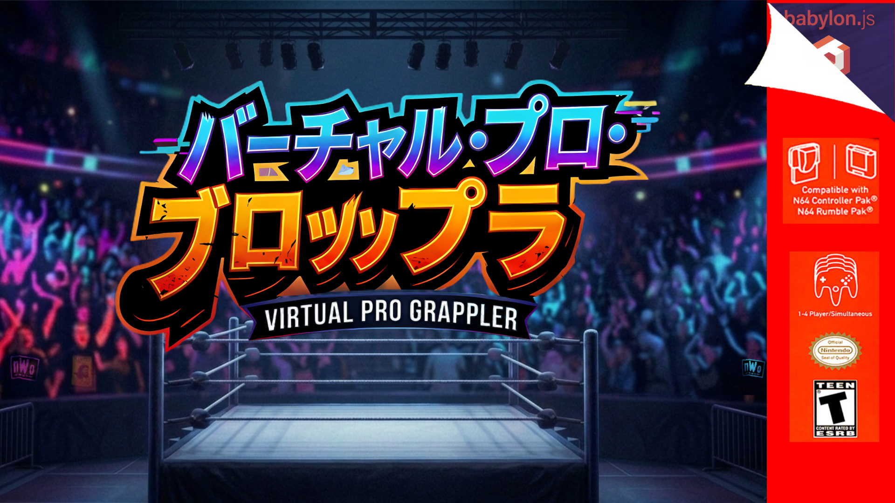

# Virtual Pro Grappler




A fully free, open-source professional wrestling video game (and engine) built on modern web technology, designed to recreate the legendary gameplay mechanics and environmental design of WWF No Mercy, Virtual Pro Wrestling 2, WCW/nWo Revenge, Def Jam Vendetta, etc.

[](https://www.gnu.org/licenses/gpl-3.0)

---

## 🎯 Project Vision

VPG Engine aims to faithfully recreate the core gameplay experience of WWF No Mercy while being:

- **Completely free and open-source** (GNU GPL 3.0)
- **Built on modern web technology** (JavaScript/Web-based)
- **Legally clean** — zero copyrighted content in the final release
- **Highly customizable** — JSON-driven content with full modding support
- Built with 


The engine is being developed using No Mercy as a design reference, with all final assets being original creations. Characters are built in Blender and exported as GLB files with per-part texture mapping.

### What We're Recreating

- **Grappling system** — The iconic position-based grappling mechanics
- **Strike system and timing** — Timing and counter-strike systems
- **Momentum (Attitude) meter** — The risk/reward special move system
- **Damage scaling** — Body part damage and move effectiveness
- **Reversal windows** — Frame-perfect timing and reversals
- **Ground game** — Submission, pin, and ground attack systems
- **Movement & physics** — Running, ropes, turnbuckles, and environmental interaction
- **Environmental accuracy** — Ring dimensions, collision points, and object behavior

---

## Project Overview

The core design principles are:

- **N64-era aesthetics** — low-poly blocky character models, baked texture shading, hard edges
- **No Mercy-faithful controls** — weak/strong grapple system, directional move modifiers, special meter, finishers
- **Data-driven characters** — every wrestler is defined entirely by JSON files, making it easy to add new characters, attires, and move sets without touching engine code
- **Texture compatibility** — the texture system is designed so that PNG files ripped from the original No Mercy ROM (via emulator tools) can be dropped into a character folder and mapped to the model with a manifest file

---
## Project Philosophy

> Data-driven. Frame-deterministic. N64-faithful. Zero frameworks.

Every wrestler is a JSON file. Every move is a JSON entry. Every mechanic — damage, reversals, spirit, specials — is derived from the documented AKI/VPW2 source research. The engine is Babylon.js + vanilla JS. Assets are Blender → GLB.

---

## Technology Stack

|Layer|Technology|Purpose|
|---|---|---|
|**Renderer**|Babylon.js 6.x|Scene, camera, meshes, materials, animation groups|
|**Runtime**|Vanilla JS (ES2022 modules)|Game loop, state machines, input, audio|
|**Assets — Models**|Blender → GLB|Character rigs, ring, arena, props|
|**Assets — Textures**|Aseprite|N64-style low-res diffuse maps (128×128 / 256×256)|
|**Data**|JSON|Characters, moves, move slots, parameters, arenas, rosters|
|**Audio**|Howler.js|SFX and music playback|
|**Dev Server**|Vite|HMR, module bundling|
|**Testing**|Vitest|Unit tests for game logic (damage, reversals, FSM)|
|**Build**|Vite prod build|Single deployable dist/ folder|

---

## Folder Structure


```
├── assets
│   ├── artwork
│   │   ├── arena1.png
│   │   ├── mainbg.jpg
│   │   ├── vpg-box-art.png
│   │   └── vpg-logo.png
│   ├── audio
│   │   ├── music
│   │   └── sfx
│   ├── glb
│   │   ├── arena
│   │   │   ├── arena-floor.glb
│   │   │   ├── arena.glb
│   │   │   ├── barricade.glb
│   │   │   └── ring-steps-positioned.glb
│   │   ├── characters
│   │   │   ├── base_mesh_male_01.glb
│   │   │   └── base_mesh_male_02.glb
│   │   └── ring
│   │       ├── ring-standard-1.glb
│   │       └── ring-standard.glb
│   ├── models
│   │   └── blender
│   │       ├── arena
│   │       │   ├── arena.blend
│   │       │   ├── arena-floor.blend
│   │       │   ├── arena-floor.blend1
│   │       │   ├── ring-steps.blend
│   │       │   └── ring-steps.blend1
│   │       ├── characters
│   │       │   ├── base_mesh_male_01.blend
│   │       │   ├── base_mesh_male_02.blend
│   │       │   └── base_mesh_male_03.blend
│   │       └── ring
│   │           └── ring-standard.blend
│   ├── schema
│   │   └── ring-steps.json
│   ├── textures
│   │   ├── arena
│   │   │   ├── floor_mat_1-double.png
│   │   │   ├── floor_mat_1-double-rotate_90.png
│   │   │   ├── floor_mat_1.png
│   │   │   ├── floor_mat-ne_corner.png
│   │   │   ├── floor_mat-nw_corner.png
│   │   │   ├── previews
│   │   │   │   ├── preview-budokan.png
│   │   │   │   ├── preview-kingofthering.png
│   │   │   │   ├── preview-mondaynitro.png
│   │   │   │   ├── preview-nomercy.png
│   │   │   │   ├── preview-rawiswar.png
│   │   │   │   ├── preview-royalrumble.png
│   │   │   │   ├── preview-smackdown.png
│   │   │   │   ├── preview-summerslam.png
│   │   │   │   ├── preview-survivorseries.png
│   │   │   │   └── preview-wrestlemania.png
│   │   │   └── texture.png
│   │   ├── characters
│   │   │   └── shared
│   │   ├── ring
│   │   │   ├── apron_raw.png
│   │   │   ├── canvas.png
│   │   │   ├── canvas_raw.png
│   │   │   └── shared
│   │   │       ├── canvas.png
│   │   │       ├── post.png
│   │   │       ├── rope-2.png
│   │   │       ├── rope.png
│   │   │       ├── steps.png
│   │   │       ├── turnbuckle-bolt-cover.png
│   │   │       ├── turnbuckle-bolt.png
│   │   │       └── turnbuckle.png
│   │   └── ui
│   │       ├── button_l.png
│   │       ├── button_r.png
│   │       ├── button_z.png
│   │       ├── fonts
│   │       │   └── xfiles.ttf
│   │       ├── heading_commissioner.png
│   │       ├── heading_multiplay.png
│   │       ├── heading_singleplay.png
│   │       └── mainmenu_bg.png
│   └── ui
├── data
│   ├── AGENT.md
│   ├── arenas
│   │   ├── budokan.json
│   │   ├── kingofthering.json
│   │   ├── mondaynitro.json
│   │   ├── nomercy.json
│   │   ├── raw.json
│   │   ├── royalrumble.json
│   │   ├── smackdown.json
│   │   ├── summerslam.json
│   │   ├── survivorseries.json
│   │   └── wrestlemania.json
│   ├── characters
│   ├── moves
│   │   ├── grapples
│   │   ├── strikes
│   │   ├── submissions
│   ├── README.md
│   └── schemas
│       ├── main-menu-schema.json
│       ├── move-slots.json
│       ├── move-database.json
│       └── move-slots-1.json
├── dist
│   ├── assets
|   |       └──TOO MANY TO LIST IN README
│   └── index.html
├── docs
│   ├── environment
│   │   └── arena-floor.md
│   ├── mechanics
│   │   ├── HSFM Blueprint.md
│   │   ├── move-damage.md
│   │   ├── move-database.md
│   │   ├── move-slot-overview.md
│   │   ├── move-slots.md
│   │   ├── Parameters.md
│   │   └── REVERSALS.md
│   └── ui
│       ├── character-options.md
│       ├── main-menu
│       │   ├── commissioner.png
│       │   ├── mainmenu-bg.png
│       │   ├── main-menu-prompt.md
│       │   ├── multiplay-exhibition-arena.png
│       │   ├── multiplay-exhibition-match.png
│       │   ├── multiplay-exhibition-player-single.png
│       │   ├── multiplay-exhibition-player-tag.png
│       │   ├── multiplay-exhibition-player-triplethreat.png
│       │   ├── multiplay-exhibition-rules
│       │   ├── multi-play.png
│       │   ├── multiplay-title.png
│       │   ├── preview-kingofthering.png
│       │   ├── preview-nomercy.png
│       │   ├── preview-rawiswar.png
│       │   ├── preview-royalrumble.png
│       │   ├── preview-smackdown.png
│       │   ├── preview-summerslam.png
│       │   ├── preview-survivorseries.png
│       │   ├── preview-wrestlemania.png
│       │   ├── single-play.png
│       │   ├── title-commissioner.png
│       │   └── title-singleplay.png
│       ├── main-menu.md
│       └── superstar-select.md
├── index.html
├── LICENSE
├── main-menu-prototype.html
├── node_modules
|   (TOO MUCH TO LIST IN README)
├── package.json
├── package-lock.json
├── public
├── README.md
├── src
│   ├── characters
│   ├── combat
│   ├── data
│   │   └── DataLoader.js
│   ├── engine
│   ├── fsm
│   │   ├── regions
│   │   └── states
│   ├── main.js
│   ├── match
│   ├── renderer
│   │   ├── ArenaRenderer.js
│   │   ├── MaterialManager.js
│   │   └── SceneManager.js
│   ├── ui
│   └── utils
├── tests
│   ├── combat
│   ├── data
│   │   └── DataLoader.test.js
│   ├── fsm
│   └── renderer
│       ├── ArenaRenderer.test.js
│       └── MaterialManager.test.js
├── vite.config.js
└── vitest.config.js
```


---


## JSON Data Formats

### Character (`data/characters/rock.json`)

```json
{
  "id": "rock",
  "displayName": "The Rock",
  "height": "6'5\"",
  "weight": "275 lbs",
  "glb": "assets/glb/characters/rock.glb",
  "attires": [
    {
      "type": 1,
      "label": "Default",
      "textures": {
        "body": "assets/textures/characters/rock/attire_1_body.png",
        "face": "assets/textures/characters/rock/attire_1_face.png"
      }
    }
  ],
  "parameters": {
    "offense": { "head": 2, "body": 3, "arms": 4, "legs": 2, "flying": 2 },
    "defense": { "head": 2, "body": 3, "arms": 2, "legs": 2, "flying": 2 }
  },
  "submissionSkill": "normal",
  "weightFactor": 5,
  "moveSlots": {
    "frontWeakGrappleSlot1": "snap_mare",
    "frontWeakGrappleSlot2": "arm_drag",
    "frontStrongGrappleSlot1": "belly_to_belly_suplex",
    "frontFinisherSlot": "rock_bottom",
    ...
  }
}
```

### Move (`data/moves/grapples/rock_bottom.json`)

```json
{
  "id": "rock_bottom",
  "displayName": "Rock Bottom",
  "type": "grapple",
  "attackParameter": "body",
  "defenseParameter": "body",
  "baseHealthDamage": 28,
  "totalFrames": 64,
  "hitFrames": [38, 39, 40],
  "reversalWindow": { "start": 5, "end": 18 },
  "jointStaminaDamage": { "body": 6, "flying": 0 },
  "technicalFlag": false,
  "animationId": "anim_rock_bottom"
}
```

---

## Dependencies (`package.json`)

```json
{
  "dependencies": {
    "@babylonjs/core": "^6.x",
    "@babylonjs/loaders": "^6.x",
    "@babylonjs/inspector": "^6.x",
    "howler": "^2.2.x"
  },
  "devDependencies": {
    "vite": "^5.x",
    "vitest": "^1.x",
    "@vitest/ui": "^1.x",
    "ajv": "^8.x"
  }
}
```

---

## Build Phases

### Phase 0 — Repo & Scaffold _(Week 1)_

Stand up the repository, dev tooling, and Babylon.js hello-world with a GLB loading test.

**Deliverables:**

- `package.json`, `vite.config.js`, `vitest.config.js`
- `index.html` with Babylon.js canvas
- `SceneManager.js` — initialises engine, scene, arcRotate camera, basic lighting
- `DataLoader.js` — fetch + AJV schema validation
- GLB round-trip test: export a Blender cube → load it in Babylon.js
- Folder structure created (empty dirs with `.gitkeep`)

---

### Phase 1 — Asset Pipeline _(Weeks 2–4)_

Establish the Blender → GLB → Babylon.js pipeline before writing any gameplay code.

**1A — Character Rig Standard**

- Define bone naming convention (matched to Babylon.js skeleton node names)
- Build `caw_template.bbmodel` in Blender (humanoid rig, N64 proportions)
- Validate in Blender: check bone rolls, rest pose, no broken weights
- Export `caw_template.glb`
- Write `CharacterRenderer.js`: load GLB, attach skeleton, test pose via bone transform

**1B — Animation Set (Core)** Minimum animations required before gameplay begins:

- Idle stand
- Walk forward / back / strafe
- Run
- Grapple initiation reach
- Hit stun (front/back)
- Knockdown (front/back)
- Getup
- Two placeholder grapple executions

Export each animation as a named `AnimationGroup` embedded in the character GLB.

**1C — Ring & Arena**

- Build ring in Blender (posts, ropes, apron, canvas)
- Export `ring_standard.glb`
- `ArenaRenderer.js`: load ring, swap canvas texture per arena JSON
- Placeholder skybox / backdrop per arena

**1D — Texture Manifest System**

- `MaterialManager.js`: reads attire JSON → applies textures to named mesh parts
- Test with The Rock attire 1 and attire 2 swap

---

### Phase 2 — Input & Core Loop _(Week 5)_

The deterministic backbone everything else depends on.

**Deliverables:**

- `FrameClock.js` — fixed 60fps timestep, frame index counter
- `InputBuffer.js` — keyboard + gamepad polling, tap vs hold detection, frame timestamp
- `GameEngine.js` — master `update()` loop: input → regions → FSM → combat eval → render
- `RNGSystem.js` — seeded deterministic RNG for reversals and interference rolls
- `TokenManager.js` — per-fighter atomic move token

**Input Mapping (Keyboard defaults):**

```
A Button    → Z key
B Button    → X key
L Button    → Q key
R Button    → E key
C-Down      → Shift (run)
D-Pad       → Arrow keys
Control Stick → WASD
```

---

### Phase 3 — Hierarchical FSM _(Weeks 6–7)_

The core state machine from `HSFM_Blueprint.md`.

**Deliverables:**

- `HFSM.js` — base `State` class, `HFSM` class with transition matrix enforcement
- `SpecialMeterRegion.js` — spirit accumulation, `isSpecialActive` flag, 100-point scale
- `InteractionRegion.js` — distance check, facing angle, `inGrappleRange`, `isBehindOpponent`
- `NeutralState.js` — Idle, Moving, Running, Evading substates
- `EngagementState.js` — GrappleInitiation (transient), GrappleHold (4 substates), ExecutingMove
- `DamageState.js` — HitStun, Knockdown, Rising, RecoveringAttack
- `GroundedState.js` — Prone, Submission, Pinning
- `Fighter.js` — assembles FSM + regions + health + renderer reference

**Test milestone:** Two fighters instantiated. Player 1 can walk toward Player 2, initiate a grapple, FSM transitions logged to console.

---

### Phase 4 — Move System _(Weeks 8–10)_

The slot resolver, move instance execution, and damage calculation.

**4A — Data Layer**

- All move JSON schemas defined and validated
- `move-slots.json` complete (mirrors `move-slots.md`)
- `MoveRegistry.js` — indexed lookup by move ID
- 10–15 moves authored as JSON (representative set: 2 front weak, 2 front strong, 1 back, 2 strikes, 1 submission, 1 finisher)

**4B — Slot Resolver**

- `SlotResolver.js` — maps (grapple state substate + input combo + context) → move slot ID
- Finisher override: if `SpecialMeterRegion.isSpecialActive` → return finisher slot
- Unit tests covering all 8 front-weak slots, 4 back slots, finisher override

**4C — Move Execution**

- `MoveInstance.js` — owns frame counter, advances per update, checks hitFrames, checks reversalWindow
- `ExecutingMove` state integration: acquires token on enter, releases on exit
- Animation playback: `CharacterRenderer.js` plays named `AnimationGroup` for move ID

**4D — Damage Calculation**

- `HealthTracker.js` — CurrentHealth (255), MaxHealth (255, floor 64), regen logic
- `JointStaminaTracker.js` — 5 limb pools (50.0 each), never regenerate, limb-hold threshold at 15.0
- `DamageCalculator.js` — full 4-factor formula from `move-damage.md`:
    - Factor 1: `floor((jointStamina + 50) × baseDamage × 0.01)` (S=50 when Special)
    - Factor 2: `floor(max(0, offenseParam - defenseParam) × baseDamage × 0.1)`
    - Factor 3: `floor(spiritDelta × 0.05)` capped at 5
    - Factor 4: `floor(T × 1.2)` if Special, else T
    - MaxHealth damage: `floor(mainHealthDamage / 4)`
    - Technical flag (0x08): skip CurrentHealth damage

**Unit tests:** Figure Four worked example from `move-damage.md §7` must pass exactly.

---

### Phase 5 — Reversal System _(Week 11)_

Full AKI reversal probability engine from `REVERSALS.md`.

**Deliverables:**

- `ReversalSystem.js`:
    - Spirit band lookup table (6 bands, 0–1000 scale)
    - Weight factor adjustment: `floor(DEF_weight/3) - floor(ATK_weight/3)` → ×2 if >0
    - Strong grapple health scaling: ×4 if health ≥192, ×2 if ≥128 (CurrentHealth vs MaxHealth depending on Special)
    - Special mode rules: disabled if attacker in Special and defender not; normal if both in Special
    - RNG roll: `RNG < probability` check using `RNGSystem`
- Integration into `ExecutingMove.onUpdate()`: poll reversal on each frame within window
- Reversal success: defender becomes attacker, new `MoveInstance` created for reversal move

**Unit tests:** Dragon Kid vs Magnum TOKYO weight example (25% → 50%) must pass.

---

### Phase 6 — Submissions & Pins _(Week 12)_

The two win conditions beyond knockout.

**Deliverables:**

- `SubmissionEscape.js`:
    - Submission skill matrix (Novice/Normal/Expert × Novice/Normal/Expert)
    - Per-wrench joint stamina bonus `B` applied to each affected limb
    - Escape condition: mash input reduces a separate "escape meter" working against hold pressure
- `PinSystem.js`:
    - Kickout window (frames configurable per move)
    - Button mash detection during pin
    - Referee count display sync

---

### Phase 7 — Match Controller & Rules _(Week 13)_

Wraps fighters into a match with configurable rules (from `main-menu.md` Rules page).

**Deliverables:**

- `MatchRules.js` — data object: timeLimit, countOut (10/20/Hardcore/None), pin, submission, TKO, ropeBreak, DQ, bloodshed, interference
- `RingBounds.js` — ring geometry zones: canvas, apron, ringside, outside; rope break detection
- `CountOutTimer.js` — per-fighter counter when outside ring
- `MatchController.js`:
    - Win condition evaluation (pin, submission, TKO, count-out, DQ, first blood)
    - Interference spawn (30/45/60s random, ally/enemy weighting)
    - Belt assignment result

---

### Phase 8 — HUD & UI _(Weeks 14–15)_

**8A — HUD (In-Match)**

- `HUD.js` — canvas-drawn overlay:
    - Dual health bars (CurrentHealth shown, MaxHealth as depleted cap — N64 faithful)
    - Spirit pip row (special meter, 0–100 in increments)
    - Timer display
    - Belt indicator if title match
    - Limb damage icons (light up when stamina < 15)

**8B — Main Menu**

- `MainMenu.js` — three-screen horizontal navigator (Single Play / Multi Play / Commissioner)
- N64 aesthetic: pixelated font, dark gradient backgrounds, cursor highlight

**8C — Match Setup Flow**

- `MatchSetup.js` — 5 sequential pages: Match → Player → Arena → Rules → Belt
- Each page implemented as a screen state in the UI state machine

**8D — Superstar Select**

- `SuperstarSelect.js` — 3×3 grid, stable pages, attire type cycling, 3D model preview
- Mirrors spec in `superstar-select.md` exactly (10 pages, empty pages skipped)
- C-Left/C-Right attire swap, Control Stick model rotation

**8E — Commissioner**

- Smackdown Mall stub: Superstar Options (Edit / Create / Clone / Change Stable)
- `CharacterOptions.js` — move slot assignment, parameter editing
- `CAWManager.js` — 18-slot save data (2 pages × 9 slots)

---

### Phase 9 — Match Types _(Weeks 16–18)_

Layer additional match types onto the core single-match foundation.

|Match Type|New Systems Required|
|---|---|
|**Tag Match**|Tag partner AI, hot-tag mechanic, legal-man enforcement|
|**Royal Rumble / Survival**|Entry queue, over-the-top elimination, 4-fighter ring|
|**Cage Match**|Cage geometry, climb mechanic, escape win condition|
|**Ladder Match**|Ladder object, climb system, briefcase retrieval|
|**Ironman Match**|Fall counter, time-limited, most falls wins|
|**Triple Threat**|3-fighter logic, who pins whom|
|**Handicap**|2v1 tag rules, CPU partner coordination|

---

### Phase 10 — Championship / Career Mode _(Week 19)_

Single-player career paths from `main-menu.md`.

**Deliverables:**

- Championship paths: World Heavyweight, Intercontinental, Tag Team, Women's, European, Hardcore
- Opponent ladder (fixed challengers per belt path)
- Smackdown Mall currency earned per match
- Unlock system: hidden characters revealed on championship completion
- Save/load (localStorage, or IndexedDB for robustness)

---

### Phase 11 — Polish & N64 Aesthetic _(Week 20)_

The rendering pass that makes it look right.

**Deliverables:**

- `N64PostProcess.js`:
    - Babylon.js `PostProcess` shader: reduce to 256-color palette
    - Optional scanline overlay (toggle)
    - Dithering pass for smooth-to-solid transitions
- Babylon.js `StandardMaterial` — no PBR (matches N64 flat shading look)
- Low-res shadow maps (256×256 blob shadows, not raycast)
- Crowd fill: billboard sprites in stadium seating
- Entrance: fighter walks down ramp with entry taunt, pyro particle effect

---

### Phase 12 — Audio _(Ongoing, finalized Week 20)_

- Howler.js integration throughout
- SFX events fired from `MoveInstance` on hitFrames
- Character entrance themes
- Crowd reaction system (responds to spirit level, near-falls, finishers)
- Menu music

---

## Testing Strategy

|Test Type|Tool|Coverage Target|
|---|---|---|
|Unit — Damage formulas|Vitest|Factor 1–4, Max Health, Technical flag|
|Unit — Reversal probability|Vitest|All spirit bands, weight factor, health scaling, Special rules|
|Unit — Slot resolver|Vitest|All input combos, finisher override|
|Unit — FSM transitions|Vitest|Legal transitions only, illegal transitions warned|
|Unit — Joint stamina|Vitest|Submission skill matrix, per-wrench math|
|Integration — Match flow|Vitest|Full pin win condition from neutral state|
|Visual — Asset pipeline|Manual|GLB loads, textures apply, animations play|

The worked example from `move-damage.md §7` (Figure Four Leglock) is the canonical integration test for the damage system.

---

## Milestone Summary

| Milestone            | Phase(s) | Target                                        |
| -------------------- | -------- | --------------------------------------------- |
| **M1: Render Proof** | 0–1      | Fighter GLB loads, walks in arena             |
| **M2: Input + FSM**  | 2–3      | Two fighters, grapple transitions logged      |
| **M3: First Move**   | 4        | One move executes end-to-end with damage      |
| **M4: Reversal**     | 5        | Reversal probability system live, testable    |
| **M5: Full Match**   | 6–7      | Pin or submission wins, rules enforced        |
| **M6: Playable**     | 8        | HUD + Superstar Select + Exhibition mode      |
| **M7: Match Types**  | 9        | All 7 match types functional                  |
| **M8: Career**       | 10       | Championship mode with unlocks                |
| **M9: Ship**         | 11–12    | N64 aesthetic pass, audio, performance review |


## Character System

### Models

Character models are built in **Blender** using a generic rigged model format and exported as **GLB** files. Babylon.js loads GLB natively, including the skeleton/bone rig and any embedded textures.

The visual style targets N64-era proportions — oversized upper bodies, thick limbs, large heads, hard cube edges. Shading is baked directly into the texture faces rather than relying on dynamic lighting, just like the original hardware did.

Each body part is a separate named mesh in the GLB, corresponding to the parts defined in the texture manifest:

```
head, neck, torso_upper, torso_lower,
shoulder_left, shoulder_right,
upper_arm_left, upper_arm_right,
forearm_left, forearm_right,
hand_left, hand_right,
wristband_left, wristband_right,
thigh_left, thigh_right,
kneepads_left, kneepads_right,
shin_left, shin_right,
boot_left, boot_right,
trunks_front, trunks_back,
trunks_side_left, trunks_side_right
```

### Texture Manifests

Each attire is defined by a JSON manifest that maps body part names to texture filenames. This design allows the game to load textures from ripped No Mercy assets without any modification — you just drop the PNGs into the attire folder and map them in the JSON.

```json
{
  "character": "the_rock",
  "attire": 1,
  "parts": {
    "head": "WWF No Mercy#A010FF85#2#1#2DC66F47_ciByRGBA.png",
    "torso_upper": "WWF No Mercy#234A7097#2#1#1602CE21_ciByRGBA.png",
    "upper_arm_left": "WWF No Mercy#8536CB12#2#1#75C6398E_ciByRGBA.png",
    ...
  }
}
```

`CharacterLoader.js` reads this manifest at load time, finds each named mesh in the GLB, and applies the corresponding texture as a `StandardMaterial` in Babylon.js. Attire switching at the character select screen is handled by swapping which manifest gets loaded — the model itself never changes.

If a body part shares a texture with another part (common in the original game), simply use the same filename in multiple slots.

### Move Assignments

Each wrestler has a `moves.json` file that assigns specific moves from the master move database to their input slots. This is what makes one wrestler feel different from another — they use the same engine and the same animation pool, but their move slot assignments are unique to them.

```json
{
  "character": "the_rock",
  "moves": {
    "front_weak_grapple_1": "Arm Drag",
    "front_weak_grapple_2": "Knee Lift",
    "front_strong_grapple_1": "DDT 01",
    "front_finisher": "Rockbottom",
    "back_finisher": "People's Elbow Setup",
    ...
  }
}
```

The full list of available moves, their power ratings, KO potential, bleed potential, and special features (Pin, Submit, etc.) is documented in `data/moves/Moves.md`.

---

## Move System

### Move Slots

The move system is built around **slots** — named input combinations that each wrestler fills with a move of their choosing. The slot system is faithful to No Mercy's original design.

The top-level slot categories are:

|Category|Description|
|---|---|
|**Grappling**|Front/Back weak and strong grapples, each with 8 directional variants|
|**Standing**|Weak strikes, strong strikes, running attacks, counter attacks|
|**Ground**|Upper/lower body submissions, ground strikes — varies by opponent position (facing up, down, sitting)|
|**Turnbuckle**|Corner grapples, tree-of-woe attacks, flying attacks from top rope|
|**Ringside**|Attacks and grapples through/over the ropes, diving attacks to outside|
|**Apron**|Attacks and grapples from the ring apron|
|**Irish Whip**|Follow-up moves after whipping an opponent into the ropes|
|**Taunt**|Standing, ducking, corner, turnbuckle, celebration, and entryway taunts|
|**Double-Team**|Co-op grapples and flying attacks with a partner|

### Input Logic

Inputs follow the original N64 controller layout, mapped to keyboard/gamepad:

|N64 Button|Action|
|---|---|
|**A (tap)**|Initiate weak grapple|
|**A (hold)**|Initiate strong grapple|
|**B (tap)**|Weak strike|
|**B (hold)**|Strong strike|
|**Control Stick**|Execute finisher (when Special is active)|
|**C-Down**|Run|
|**R**|Counter / reversal|
|**L**|Irish whip / rope interaction|

Directional modifiers (←/→/↑/↓) on the analog stick change which move fires within a grapple state. For example, in a Front Strong Grapple, pressing ↑ + A fires slot `front_strong_grapple_3`, while pressing ↓ + B fires slot `front_strong_grapple_8`.

`InputManager.js` reads raw inputs each frame and passes them to `MoveEngine.js`, which checks the current character state (standing, grappling, downed, running, etc.) and resolves which move slot is being requested. `MoveEngine.js` then looks up that slot in the character's `moves.json` and triggers the corresponding animation and damage/effect logic.

### Move Database

Every move in the game is defined in the master move database (`data/moves/Moves.md`) with the following properties:

|Property|Description|
|---|---|
|**Power**|Damage tier: F (weakest) → E → D → C → B → A → S (strongest), G for special gag moves|
|**KO**|Whether this move can cause a knockout|
|**Bleed**|Whether this move can open a blade job|
|**Feature**|Special outcome: `Pin` (goes straight to pin attempt), `Submit` (applies a submission hold), or `Null`|

Moves are organized by which slot category they are eligible for — for example, finisher-tier moves only appear in the Finisher slot lists.

---

## Game Systems

### Grapple System

`GrappleSystem.js` manages the grapple state machine. When a player initiates a grapple:

1. A proximity and facing check determines if the grapple connects
2. The grapple type (weak/tap A, or strong/hold A) and the opponent's position (front, back, corner, apron) determine which slot category is now active
3. The game enters a **grapple hold state** — both characters are locked together and the attacking player has a short window to input a directional + button combination
4. If no input is made, the grapple is broken
5. If the defending player inputs a reversal (R) with correct timing, the grapple counters

### Finisher System

`FinisherSystem.js` manages the Special meter:

- The meter fills as a wrestler deals and receives damage, and by performing taunts
- When the meter is full, the **Special** state activates — indicated in the HUD
- While Special is active, the Control Stick in a grapple triggers the character's finisher move instead of a regular grapple move
- Performing a finisher empties the Special meter
- Special also upgrades certain ground and turnbuckle moves to their finisher variants

### Match Manager

`MatchManager.js` handles overall match state:

- Tracks health for both wrestlers (displayed as a damage meter, not hit points — heavier moves deal more damage)
- Manages pin attempts — initiating a pin, the count animation, and kickout window
- Manages submission attempts — hold application, struggle mechanic, tap-out detection
- Handles count-out logic for wrestlers outside the ring
- Determines win conditions (pin, submission, KO, count-out, disqualification)
- Triggers the post-match celebration taunt sequence

---

## Adding a New Wrestler

1. **Build the model** in Blender following the standard bone/mesh naming convention, export as GLB
2. **Create the character folder** under `assets/characters/your_wrestler/`
3. **Add texture folders** — `base/` for skin textures, plus one folder per attire
4. **Create attire manifests** — one `attire_N.json` per attire, mapping each body part to its texture file
5. **Create `moves.json`** — assign a move from the master database to each input slot
6. **Add to roster** — add an entry to `data/characters/roster.json` pointing to the character folder

No engine code needs to change. The character loader, move engine, and all game systems are entirely data-driven.

---

## Tech Stack

|Tool|Purpose|
|---|---|
|[Babylon.js](https://www.babylonjs.com/)|3D rendering engine, physics, animation|
|GLB / glTF|Character model format|
|JSON|Character data, texture manifests, move assignments|
|Vanilla JS|Game logic (no framework)|

---

## 🤝 How to Contribute

We need help from the community to document No Mercy's intricate systems! You can contribute by:

- **Playing and observing** No Mercy to document mechanics
- **Measuring** environmental elements (ring size, distances, etc.)
- **Analyzing** frame data, timing windows, and damage values
- **Writing documentation** in Markdown format
- **Creating JSON schemas** for structured data
- **Organizing** research materials and findings

**No programming experience required for Phase 1!** If you love No Mercy and want to help preserve its design, you can contribute.

---

## 🎮 Design Principles

### Accuracy First

We aim to recreate No Mercy's feel as faithfully as possible. When in doubt, we defer to how No Mercy actually works.

### No Copyrighted Content

The final game will contain:

- ❌ No WWE/WWF characters, logos, or branding
- ❌ No licensed music or copyrighted assets
- ✅ Original characters, arenas, and assets
- ✅ Full customization through JSON and user-provided media

### Open and Moddable

Everything is designed to be:

- Human-readable (JSON, not binary formats)
- Easily customizable (characters, moves, arenas, belts)
- Community-driven (open contribution model)

---

## 📜 License

This project is licensed under the GNU General Public License v3.0. See LICENSE.md for details.

This means:

- ✅ Free to use, modify, and distribute
- ✅ Must remain open-source
- ✅ Derivative works must use the same license

---

## 🙏 Acknowledgments

This project is inspired by the legendary work of:

- **AKI Corporation** — Developers of WWF No Mercy, WWF WrestleMania 2000, WCW/nWo Revenge, WCW World Tour, Virtual Pro Wrestling 64, and Virtual Pro Wrestling 2
- **The No Mercy modding community** — Years of dedication to this game

We are not affiliated with WWE, AKI Corporation, or THQ. This is a fan project created out of love for the gameplay mechanics and design principles of No Mercy.

---

## 📞 Community

- **Issues**: Use GitHub Issues for documentation questions and discussions
- **Discussions**: Share research findings and observations

Let's build something amazing together! 🤼‍♂️
