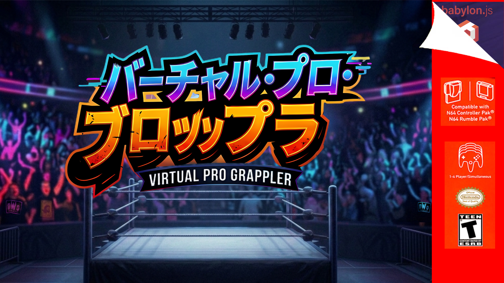

# Virtual Pro Grappler



[](https://www.gnu.org/licenses/gpl-3.0)


Virtual Pro Grappler is an open-source professional wrestling game and engine inspired by the AKI-era N64 wrestling games: WWF No Mercy, Virtual Pro Wrestling 2, WCW/nWo Revenge, and related titles.

The project is currently in an early engine and tooling phase. The focus right now is building the data model, UI flow, arena rendering pipeline, and control mapping foundation before full match gameplay comes online.

## Current State

What runs today:

- A data-driven main menu built from `data/ui/main-menu.json`.
- A single main menu with Multi Play, Single Play, and Commissioner submenus.
- A Commissioner Controls screen with remappable keyboard bindings.
- UI button texture support for D-pad, control stick, C-buttons, A, B, Z, Start, L, and R.
- An Arena Viewer selection screen with arena preview images.
- A combat system tester with player and opponent, in a ring, with stats heads-up display
- Babylon.js arena loading only after an arena is selected/opened.
- Arena Viewer camera controls for rotate and zoom.
- JSON schemas for main menu data, moves, and move slots.
- Move and move-slot data files under `data/moves`.
- Arena definitions under `data/arenas`.
- Vite build/dev tooling and Vitest test setup.

## Getting started

```bash
npm install
npm run dev        # http://localhost:8080
```

| Script | Does |
|---|---|
| `npm run dev` | Vite dev server |
| `npm run build` | Typecheck, then production build |
| `npm run typecheck` | `vue-tsc` over src and tests |
| `npm test` | Vitest unit suite, including data validation |
| `npm run test:watch` | Vitest in watch mode |
| `npm run validate:data` | Schemas, asset references and menu targets in `data/` |
| `npm run assets:promote` | Copy the shipped asset subset out of `assets/source` |

## Layout

```text
.
├── assets/
│   ├── runtime/         # Served at the site root: GLB models, textures, favicon
│   ├── artwork/         # Logo and menu backgrounds
│   ├── textures/        # Arena, ring and UI art, plus menu fonts
│   ├── schema/          # Measured geometry manifests for the ring assets
│   └── source/          # Blender, Quaternius and Mixamo originals, never shipped
├── data/                # JSON content and JSON schemas
│   ├── moves/           # Move catalog and slot definitions
│   ├── arenas/          # One file per arena
│   ├── ui/              # Main menu pages and copy
│   ├── schemas/         # JSON schemas for the content files
│   └── settings/        # Default control mappings
├── docs/                # UI, environment, and mechanics documentation
├── src/
│   ├── combat/          # Damage, reversals, wrestler state, match
│   ├── data/            # Data loading helpers and asset resolution
│   ├── game/            # Movement, input, virtual controller, tuning
│   ├── renderer/        # Babylon scenes, arena viewer, ropes, animation
│   ├── sim/             # Fixed timestep, input buffer, seeded RNG
│   ├── ui/              # Vue shell, menu, mapper, arena viewer, debug overlay
│   └── main.ts          # App entry
├── tests/
│   ├── unit/            # Vitest
│   └── browser/         # Playwright scripts driving the real game
├── tools/               # Asset pipeline (Blender) and data validation
├── index.html
├── package.json
└── vite.config.ts
```

### Assets

`assets/source` is the authoring tree — ~265MB of Blender, Quaternius, Mixamo
and raw GLB originals. **Nothing there reaches the browser.** The shipped
subset is copied out by:

```bash
npm run assets:promote        # copy anything missing or stale
npm run assets:promote -- --check   # report drift without changing anything
```

The manifest in [`tools/promote-assets.mjs`](tools/promote-assets.mjs) is the
record of what ships and where it lands, so a working asset tree is
reproducible from source rather than something assembled by hand.

There are two destinations, because there are two ways a file reaches the
browser — `assets/runtime/**` is Vite's public directory, served at the site
root, and `assets/glb/**` and `assets/textures/**` are bundled and referenced
from JSON by repository path.

Consumers do not need to know which is which:
[`resolveAsset()`](src/data/assets.ts) takes a path as authored and returns a
URL either way. That is the single entry point — new code should not build
asset URLs by hand.

## Menu

The app opens on a data-driven menu defined by
[`data/ui/main-menu.json`](data/ui/main-menu.json):

```text
Main Menu
├── Multi Play          (not implemented)
├── Single Play         (not implemented)
└── Commissioner
    ├── Smackdown Mall
    │   └── Combat System Test   → the playable prototype
    ├── Options         (not implemented)
    ├── Arena Viewer    → the arena viewer
    └── Controls        → the control mapper
```

The **Arena Viewer** lists the ten arenas in [`data/arenas/`](data/arenas/)
with their preview art, and renders the selected one: the ring, two sets of
steps, and the environment GLBs the arena file names, with its texture and
colour overrides applied. The control stick orbits the camera, `C-Up`/`C-Down`
zoom, `Esc` closes. It renders the ring's static rope meshes rather than the
elastic `RingRopes` system, which is gameplay rather than presentation.

Menus are driven by a virtual N64 pad rather than raw keys: arrows or `W`/`S`
move the cursor, `Enter` selects, `Esc` goes back, and `Z` shows the
instructions panel for the highlighted item. Rebinding any of those in
Controls changes the menus with it.

The control mapper lists all 18 pad inputs, warns before taking a key that is
already in use, persists to `localStorage` under `vpg-control-mappings`, and
can reset to defaults or export the active mapping as JSON.

## Controls

| Input | Action |
|---|---|
| `W` `A` `S` `D` | Move |
| `Shift` | Run — alone runs ahead; press a direction first to run that way |
| `J` | Punch |
| `K` | Kick |
| `L` | Jump |
| `P` | Block, or roll while running |

Running into the ropes rebounds across the ring; running into a corner climbs
to the top rope.

> These are the in-match prototype bindings, and they are **separate from the
> pad mapping the menus use**. `InputController` still has its own hardcoded
> keys, while the menus and the control mapper go through the N64 pad mapping
> in `data/settings/control-mappings.json`. Rebinding in Controls therefore
> changes menu navigation but not gameplay yet. The move slots in
> `data/moves/move-slots.json` are written against that same pad, so gameplay
> is the side still to be reconciled.

## Asset pipeline

For now, Character GLBs are built by retargeting the source (Quaternius) animation libraries
onto the base characters:

```bash
blender --background --python tools/blender_retarget.py
```

This reads from `assets/source` and writes to `assets/runtime/models`. See the
script's header for why the retarget is delta-based rather than a direct
channel copy.
