You are a senior game UI engineer and Babylon.js expert.

Your task is to build a polished front-end prototype of a complete main menu system for a professional wrestling video game using HTML, CSS, JavaScript, and Babylon.js (including HTMLMesh where appropriate).

Context:
- I will provide screenshot images of the desired UI.
- You must closely replicate those screenshots in layout, styling, and visual hierarchy.
- The menu system must strictly follow the structure defined below.
- The image is in the background, and when on the first screen (Multi Play), it is zoomed in a little, and all the way to the left.  Switching to the other menus, the transition zooms out, then over, and then zooms back in a little.
- The menus have a semi transparent background (`background-color: rgba(54,45,187,0.35);`). See CSS below.
- This is a front-end prototype, not a fully integrated gameplay menu system yet.
- For arena selection screens, show only arenas backed by the current JSON files/assets in the project.
- Arena preview images are specified in the arena JSON files and the preview image assets live under `/assets/textures/arena/previews`.
- Features that are not fully specified or not yet backed by game data should use placeholders for now.


---

## CORE MENU STRUCTURE

---

The main menu consists of THREE primary screens navigated horizontally (like D-Pad left/right), in this exact left-to-right order:

1. Multi Play

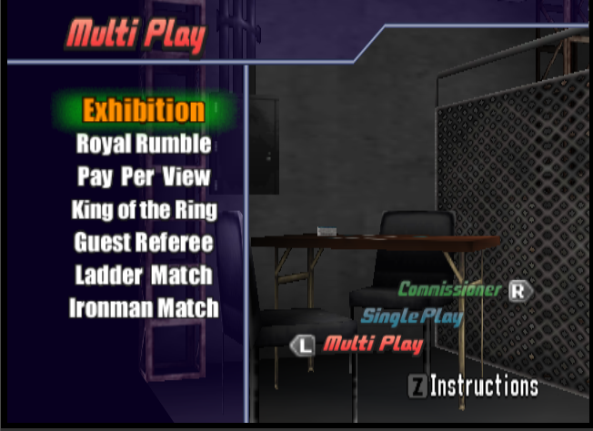

2. Single Play

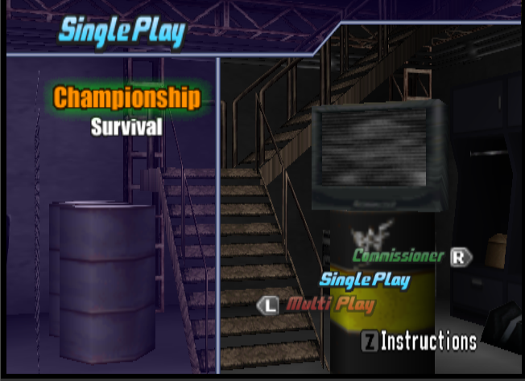

3. Commissioner

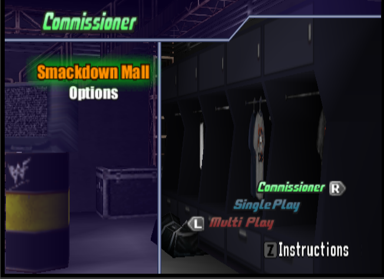


Implement smooth horizontal transitions between these screens, and use the background and styles included below to match the screenshots as best as you can:


Styles:

```css

.gamemenu-style {
  box-shadow: 0 0 5px #ADD8E6,inset 0 0 5px 2px #ADD8E6;
  border-radius: 6px;
  background-color: rgba(54,45,187,0.35);
}

.gamemenu-item {
  color: #ffffff;
  letter-spacing: -2px;
  line-height: 18px !important;
  -webkit-text-stroke-width: 0.5px;
  -webkit-text-stroke-color: #000000;
  padding: 10px 20px;
  font-family: Oswald,sans-serif;
  font-size: 34px;
  font-weight: 700;
  text-decoration: none;
  position: relative;
  background: transparent;
  border: none;
  cursor: pointer;
  margin: 4px;
  transition: -webkit-text-fill-color 0.2s ease,-webkit-text-stroke-width 0.2s ease;
}

.gamemenu-item:hover, .gamemenu-item:focus, .gamemenu-item.active {
  -webkit-text-fill-color: #f28f3d;
  -webkit-text-stroke-width: 2px;
  animation: glowPulse 1s ease-in-out infinite;
}

```

Background:

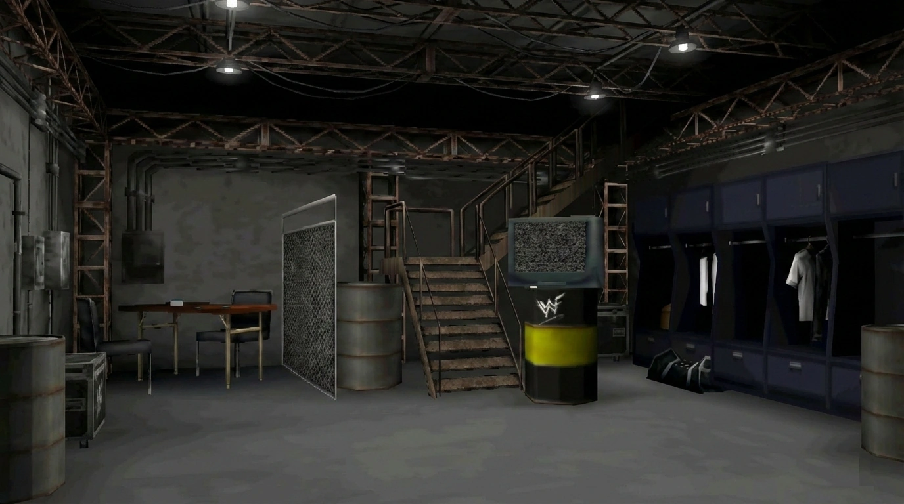


---------------------------------------
MULTI PLAY
---------------------------------------

Heading (Use Image):


Menu options:
- Exhibition
- Royal Rumble
- Pay-Per-View
- King of the Ring
- Guest Referee
- Ladder Match
- Ironman Match

![[multi-play.png]]

---------------------------------------
EXHIBITION FLOW (MULTI-STEP MENU)
---------------------------------------

Selecting "Exhibition" opens a multi-page flow:

1. Match
2. Player
3. Arena
4. Rules
5. Belt
6. Superstar Select (final screen)

Each page must be a separate UI state with forward/back navigation.

1. MATCH OPTIONS:
	- Single Match
	- Tag Match
	- Triple Threat Match
	- Handicap Match
	- Cage Match

![[multiplay-exhibition-match.png]]


2. PLAYER SETUP:

![[multiplay-exhibition-player-single.png]]
![[multiplay-exhibition-player-tag.png]]
![[multiplay-exhibition-player-triplethreat.png]]

	- Dynamically adapt options based on:
		- Match type
		- Number of connected controllers (simulate if needed)

ARENA OPTIONS:

![[multiplay-exhibition-arena.png]]


- RAW is WAR

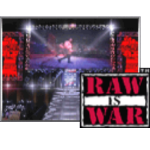

- No Mercy

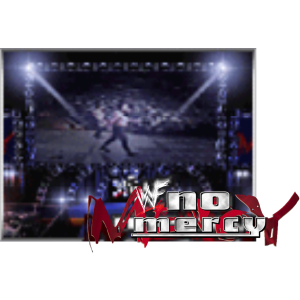

- SMACKDOWN


- King of the Ring

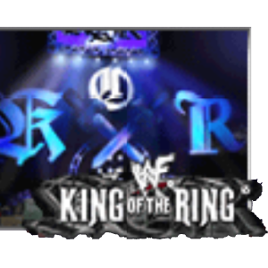

- Summerslam

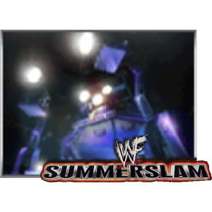

- Survivor Series

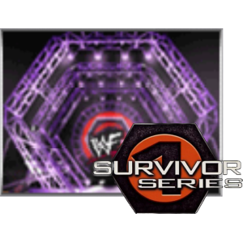

- Royal Rumble

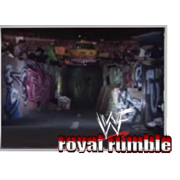

- Wrestlemania

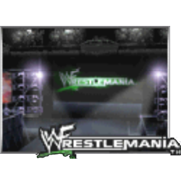

RULES OPTIONS:
- Time Limit (5, 10, 15, 30, 60, No Limit)
- Count Out (10, 20, Hardcore, No Count)
- Pin (Yes/No)
- Submission (Yes/No)
- TKO (Yes/No)
- Rope Break (Yes/No)
- DQ (Yes/No)
- Bloodshed (Yes / No / First Blood)
- Interference (Yes/No)

BELT:
- Default: Non Title Match
- Support dynamic list of unlocked belts

---------------------------------------
ROYAL RUMBLE (MULTI PLAY)
---------------------------------------

Flow pages:
- Order (Random, Select, Team Battle)
- Number
- Player
- Arena
- Rules
- Belt

---------------------------------------
SINGLE PLAY
---------------------------------------

Heading (Use Image):


Menu Options:
- Championship
- Survival

![[single-play.png]]


CHAMPIONSHIP:
- Career paths for:
  - World Heavyweight
  - Intercontinental
  - Tag Team
  - Women's
  - European
  - Hardcore


SURVIVAL:
- Royal Rumble-style mode
- 1 Player vs CPU only
- 4 characters start in ring
- Rewards system (money per elimination)

---------------------------------------
COMMISSIONER
---------------------------------------

Options:
- Smackdown Mall
- Options

SMACKDOWN MALL:
- Superstar Options
- Shop
- Data

SUPERSTAR OPTIONS:
- Edit a Superstar
- Create a Superstar
- Clone a Superstar
- Change Stable
- Stable Name

CREATE A SUPERSTAR:
- Grid-based save slots (3x3 per page, multiple pages)

---

## IMPLEMENTATION NOTES

- Input model for the prototype:
  - Up / Down = move within a menu or list
  - Left / Right = switch primary screens where appropriate
  - Enter = confirm / advance
  - Escape = back
- Use placeholder content and placeholder intermediate states where the flow is listed here but not yet fully specified.
- For the Arena page, populate choices from the arena JSON data that currently exists in the project rather than hardcoding the full historical WWF No Mercy arena list.
- Overwrite confirmation dialog

---------------------------------------
TECHNICAL REQUIREMENTS
---------------------------------------

1. UI Implementation

- Use HTML + CSS for menus
- Use Babylon.js for 3D background
- Use HTMLMesh for:
  - Diegetic menus OR
  - In-world UI panels (optional but encouraged)

2. Navigation System
- Fully state-driven menu system
- Support:
  - Keyboard
  - Mouse
  - Gamepad (D-Pad navigation is critical)

3. Visual Fidelity
- Match provided screenshots closely
- Include:
  - Hover states
  - Focus states
  - Active selections
  - Animated transitions

4. Animation
- Smooth transitions between:
  - Main screens (horizontal slide)
  - Submenus (fade/scale/slide)
- Add subtle UI animations (highlight, glow, etc.)

5. Code Structure
- Modular architecture:
  - Menu state manager
  - UI components
  - Babylon scene setup
- Use clean ES6+ syntax

6. Data-Driven Design
- Menu options should be defined in structured JSON where possible
- Allows easy expansion of modes and rules


---------------------------------------
IMPORTANT INSTRUCTION
---------------------------------------

When screenshots are provided:
1. First analyze layout and hierarchy
2. Then recreate structure in HTML
3. Then apply styling to match visuals closely

Do NOT skip analysis before implementation.
